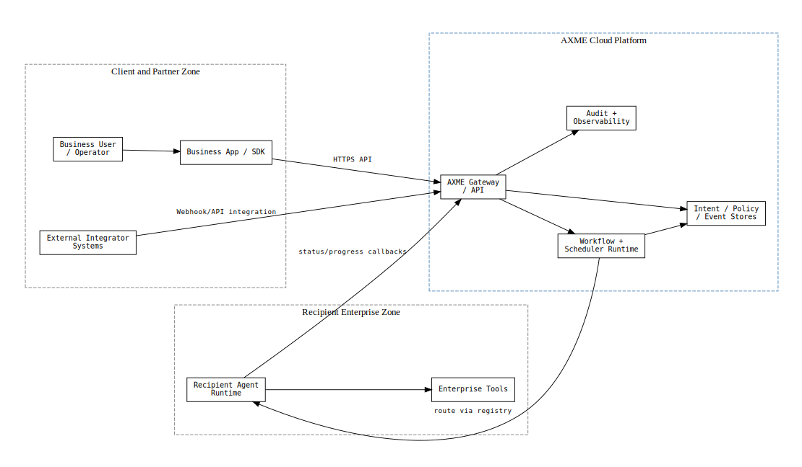
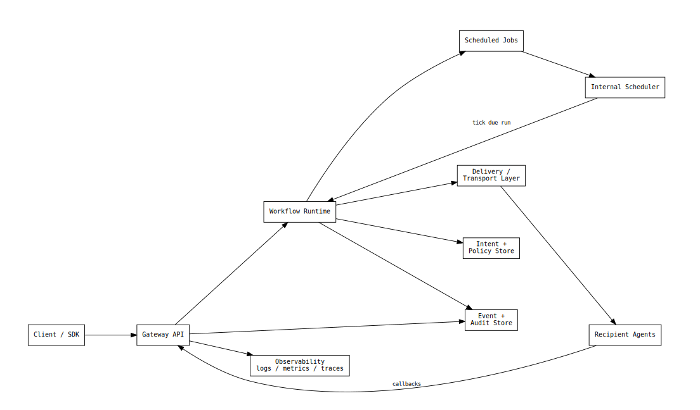
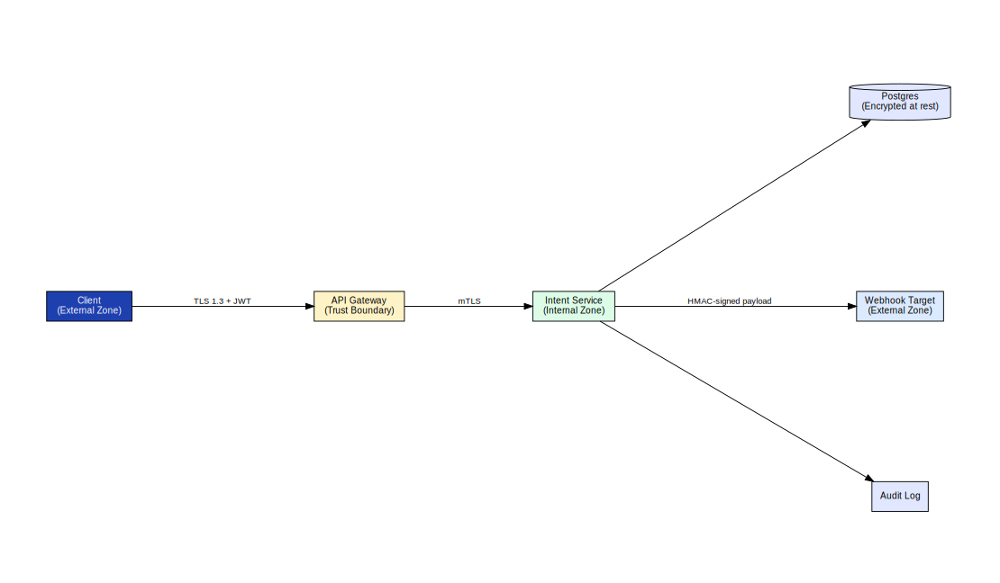
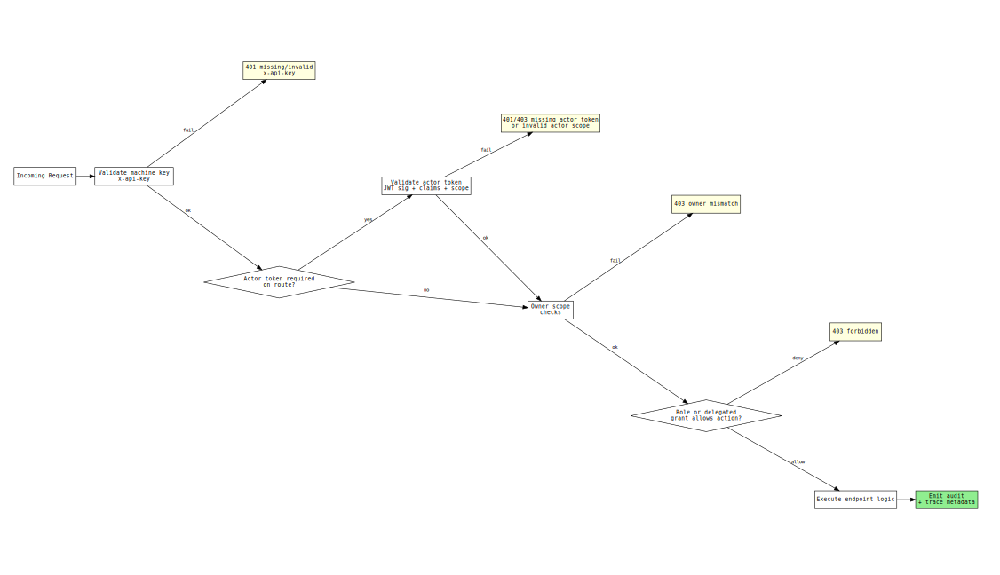

# axme-docs

**Public documentation for the AXME platform** — API references, protocol specifications, integration guides, security model, and the full visualization program.

> **Alpha** · Protocol and API surface are stabilizing. Not recommended for production workloads yet.  
> Alpha access: https://cloud.axme.ai/alpha · Contact and suggestions: [hello@axme.ai](mailto:hello@axme.ai)

---

## What Is AXME?

AXME is a coordination infrastructure for durable execution of long-running intents across distributed systems.

It provides a model for executing **intents** — requests that may take minutes, hours, or longer to complete — across services, agents, and human participants.

## AXP — the Intent Protocol

At the core of AXME is **AXP (Intent Protocol)** — an open protocol that defines contracts and lifecycle rules for intent processing.

AXP can be implemented independently.  
The open part of the platform includes:

- the protocol specification and schemas
- SDKs and CLI for integration
- conformance tests
- implementation and integration documentation

## AXME Cloud

**AXME Cloud** is the managed service that runs AXP in production together with **The Registry** (identity and routing).

It removes operational complexity by providing:

- reliable intent delivery and retries  
- lifecycle management for long-running operations  
- handling of timeouts, waits, reminders, and escalation  
- observability of intent status and execution history  

State and events can be accessed through:

- API and SDKs  
- event streams and webhooks  
- the cloud console

---

## Repository Structure

```
axme-docs/
├── docs/
│   ├── diagrams/              # Full visualization program (SVG / PNG / DOT / MMD sources)
│   │   ├── intents/           # Intent lifecycle, policy, delivery, approvals
│   │   ├── platform/          # System context, container view, enterprise placement
│   │   ├── protocol/          # Protocol envelope, versioning, idempotency, transport
│   │   ├── api/               # API method families, error model, pagination, quotas
│   │   ├── security/          # Auth/authz, crypto, trust boundaries, threat model
│   │   ├── operations/        # Release, DR, SLOs, observability, runbooks
│   │   └── website/           # Diagrams for the public website / landing page
│   ├── openapi/               # OpenAPI artifacts for the public API surface
│   ├── connectors/            # Connector setup guides (HTTP, webhook, MCP)
│   ├── integration-quickstart.md
│   ├── public-api-auth.md
│   ├── public-api-families-d1-intents-inbox-approvals.md
│   ├── supported-limits-and-error-model.md
│   └── migration-and-deprecation-policy.md
├── scripts/
│   └── validate_docs.py
└── tests/
```

---

## Platform Overview

The diagram below shows how AXME components relate: the public gateway, control plane services, connectors, and client SDKs.



*The gateway is the single public entry point. Intents flow from SDK clients through TLS to the gateway, which routes them into the durable scheduler and connector layer. Webhooks and MCP callbacks leave the platform from the connector side, cryptographically signed.*

---

## Intent Lifecycle

Every intent progresses through a well-defined state machine. The diagram below shows all states, transitions, and terminal outcomes.


*Key states: `PENDING → PROCESSING → WAITING_* → DELIVERED → RESOLVED`. Any intent can be cancelled or expire at most transition points. Retry loops are bounded by the policy envelope.*

The complete runtime container view — services, databases, queues, and their connections:



*Gateway, auth service, registry, scheduler, connector runtime, and policy engine run as independent services. Each has a dedicated store; the durable scheduler owns the retry/wakeup loop.*

---

## Integration Quickstart

1. **Get alpha access** at https://cloud.axme.ai/alpha
2. Choose your SDK: [Python](https://github.com/AxmeAI/axme-sdk-python) · [TypeScript](https://github.com/AxmeAI/axme-sdk-typescript) · [Go](https://github.com/AxmeAI/axme-sdk-go) · [Java](https://github.com/AxmeAI/axme-sdk-java) · [.NET](https://github.com/AxmeAI/axme-sdk-dotnet)
3. Follow `docs/integration-quickstart.md` for the full onboarding path

```bash
# Validate this documentation repo locally
python -m pip install -e ".[dev]"
python scripts/validate_docs.py
pytest
```

---

## Key Documents

| Document | Description |
|---|---|
| [`integration-quickstart.md`](docs/integration-quickstart.md) | End-to-end onboarding path for new integrators |
| [`public-api-auth.md`](docs/public-api-auth.md) | Authentication: platform API keys, actor tokens, JWT validation |
| [`security-overview.md`](docs/security-overview.md) | Public security architecture, controls, and enterprise review baseline |
| [`public-api-families-d1-intents-inbox-approvals.md`](docs/public-api-families-d1-intents-inbox-approvals.md) | Full API family reference for intents, inbox, and approvals |
| [`supported-limits-and-error-model.md`](docs/supported-limits-and-error-model.md) | Rate limits, quotas, error codes, retriability table |
| [`migration-and-deprecation-policy.md`](docs/migration-and-deprecation-policy.md) | API versioning, deprecation timelines, migration guides |

---

## Protocol

AXP wraps every intent in a signed envelope. The protocol layer ensures integrity, ordering, and schema version negotiation.


*The envelope carries the intent payload, sender identity, schema version, idempotency key, and a gateway-applied HMAC signature. Recipients verify the signature before processing.*

Idempotency and replay protection are first-class protocol features:


*Duplicate requests bearing the same idempotency key return the cached response without re-executing. Replay attacks are rejected by the nonce registry.*

---

## Security Model

The platform enforces layered security boundaries. The trust boundary diagram maps each enforcement point:



*Public-facing TLS terminates at the gateway. Internal service calls use mTLS. Data at rest is encrypted with AES-256-GCM. Webhook payloads carry HMAC-SHA256 signatures.*

Security control baseline for enterprise review: [`docs/security-overview.md`](docs/security-overview.md).

Authentication and authorization enforcement flow:



*API key verification → JWT validation → org/workspace scope check → role-based access → resource-level policy grant evaluation. All steps are audited.*

---

## Visualization Program

The `docs/diagrams/` directory is the canonical home for all platform visualizations. Each diagram is available in four formats: `.mmd` (Mermaid source), `.dot` (Graphviz source), `.svg` (rendered vector), and `.png` (raster).

- **[Visualization Backlog & Status](docs/diagrams/VISUALIZATION_BACKLOG.md)** — P0 / P1 / P2 diagram inventory
- **[Diagram Usage Matrix](docs/diagrams/DIAGRAM_USAGE_MATRIX.md)** — which diagrams appear in which repositories
- **[Repository Distribution Plan](docs/diagrams/REPO_DISTRIBUTION_PLAN.md)** — placement strategy

---

## Related Repositories

| Repository | Role |
|---|---|
| [axme-spec](https://github.com/AxmeAI/axme-spec) | Canonical schema and protocol contracts |
| Control-plane runtime (private) | Internal runtime implementation |
| [axme-conformance](https://github.com/AxmeAI/axme-conformance) | Conformance and contract test suite |
| [axme-sdk-python](https://github.com/AxmeAI/axme-sdk-python) | Python SDK |
| [axme-sdk-typescript](https://github.com/AxmeAI/axme-sdk-typescript) | TypeScript SDK |
| [axme-sdk-go](https://github.com/AxmeAI/axme-sdk-go) | Go SDK |
| [axme-sdk-java](https://github.com/AxmeAI/axme-sdk-java) | Java SDK |
| [axme-sdk-dotnet](https://github.com/AxmeAI/axme-sdk-dotnet) | .NET SDK |
| [axme-cli](https://github.com/AxmeAI/axme-cli) | Command-line interface |

---

## Contributing & Contact

- Bug reports and docs feedback: open an issue in this repository
- Alpha access: https://cloud.axme.ai/alpha · Contact and suggestions: [hello@axme.ai](mailto:hello@axme.ai)
- Security disclosures: see [SECURITY.md](SECURITY.md)
- Contribution guidelines: [CONTRIBUTING.md](CONTRIBUTING.md)
