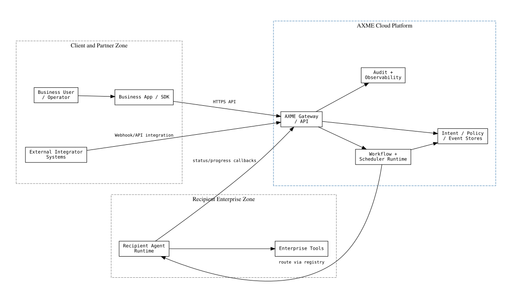
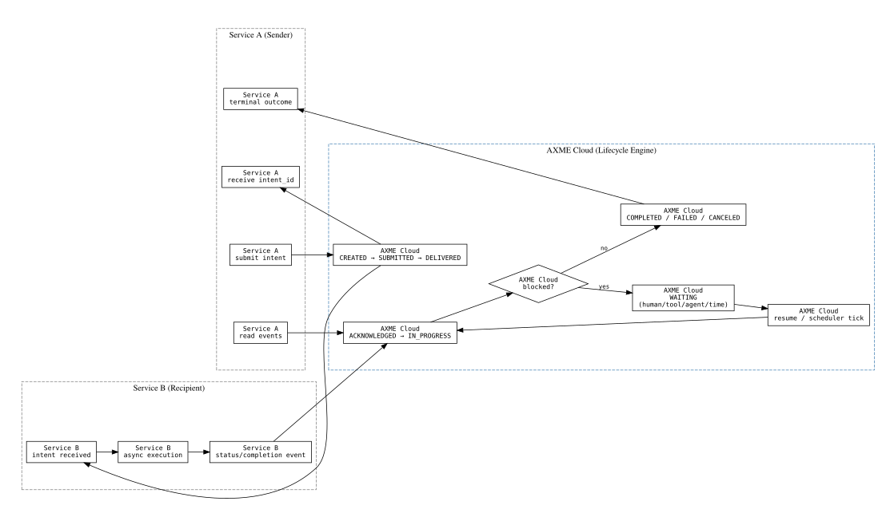
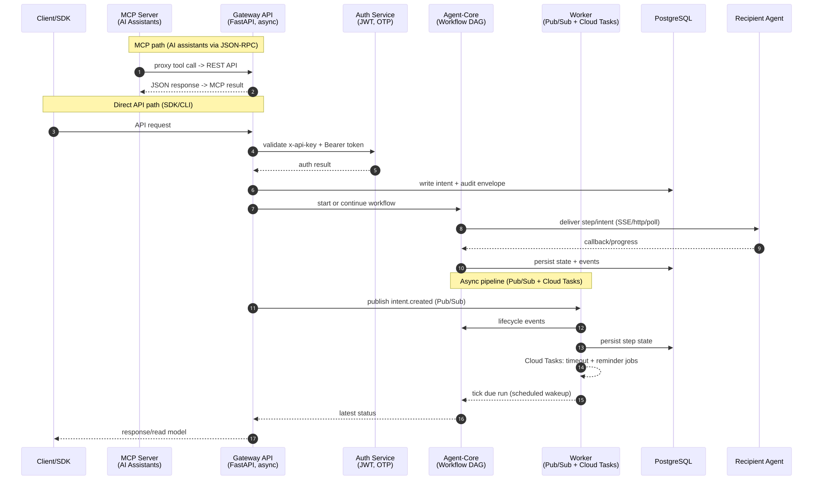
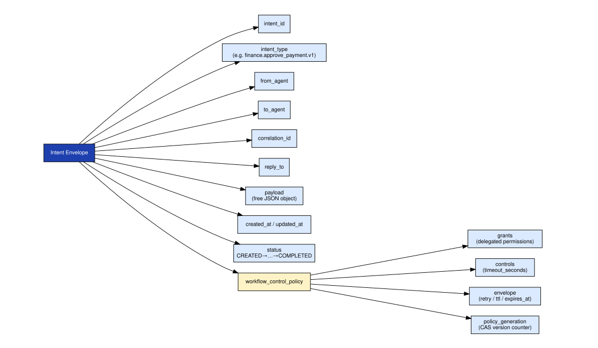
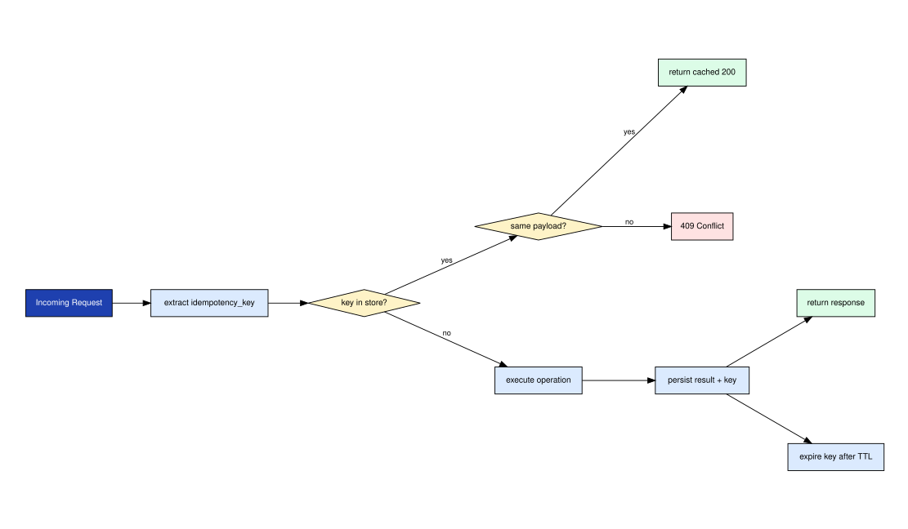
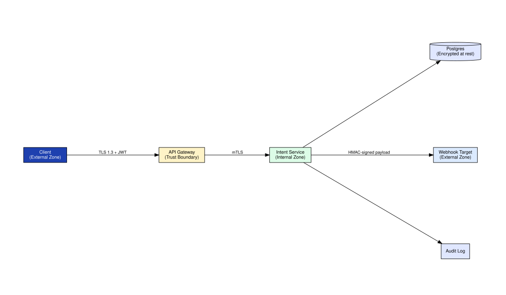
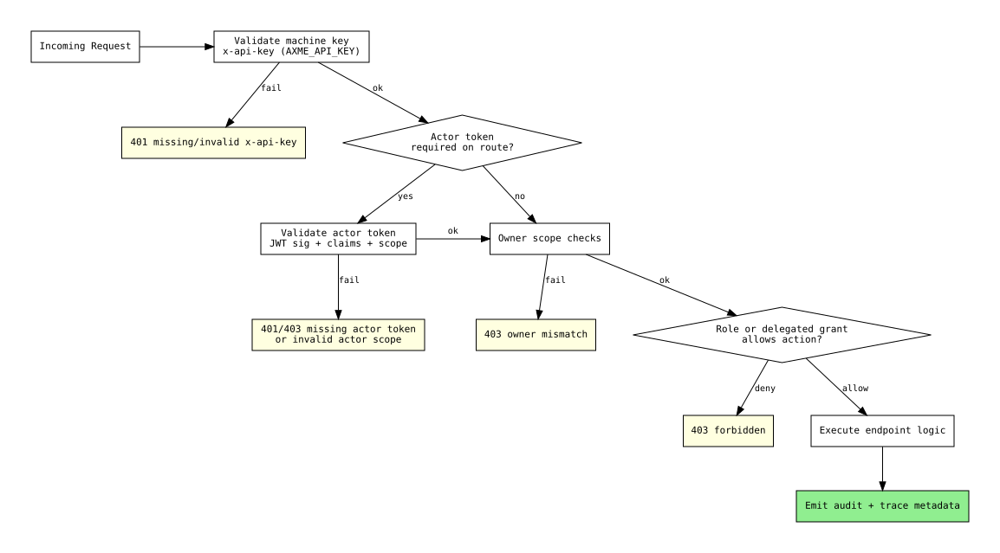

# axme-docs

Implementation docs, API reference, security model, and architecture diagrams for the AXME platform.

[](https://cloud.axme.ai/alpha/cli)
[](LICENSE)

[Quick Start](https://cloud.axme.ai/alpha/cli) · [axme](https://github.com/AxmeAI/axme) · [Spec](https://github.com/AxmeAI/axp-spec) · [Examples](https://github.com/AxmeAI/axme-examples)

---

## Integration Quickstart

1. **Install the CLI and run your first example**: https://cloud.axme.ai/alpha/cli
2. Choose your SDK: [Python](https://github.com/AxmeAI/axme-sdk-python) · [TypeScript](https://github.com/AxmeAI/axme-sdk-typescript) · [Go](https://github.com/AxmeAI/axme-sdk-go) · [Java](https://github.com/AxmeAI/axme-sdk-java) · [.NET](https://github.com/AxmeAI/axme-sdk-dotnet)
3. Follow `docs/integration-quickstart.md` for the full onboarding path
4. Example hubs:
   - Cloud runnable: [axme-examples/examples](https://github.com/AxmeAI/axme-examples/tree/main/examples)
   - Protocol-only: [axme-examples/protocol](https://github.com/AxmeAI/axme-examples/tree/main/protocol)

---

## Key Documents

| Document | Description |
|---|---|
| [`integration-quickstart.md`](docs/integration-quickstart.md) | End-to-end onboarding path for new integrators |
| [`public-api-auth.md`](docs/public-api-auth.md) | Authentication: platform API keys, actor tokens, JWT validation |
| [`security-overview.md`](docs/security-overview.md) | Security architecture, controls, and enterprise review baseline |
| [`supported-limits-and-error-model.md`](docs/supported-limits-and-error-model.md) | Rate limits, quotas, error codes, retriability table |
| [`migration-and-deprecation-policy.md`](docs/migration-and-deprecation-policy.md) | API versioning, deprecation timelines, migration guides |
| [`mcp-api-reference.md`](docs/mcp-api-reference.md) | MCP Server - all 48 tools, auth model, response format |
| [`cross-org-receive-policy.md`](docs/cross-org-receive-policy.md) | Cross-org intent delivery: org policy + agent overrides |
| [`agent-addressing.md`](docs/agent-addressing.md) | Agent address registry, agent:// URI scheme |

### API Family References

| Document | Scope |
|---|---|
| [`D1 - Intents, Inbox, Approvals`](docs/public-api-families-d1-intents-inbox-approvals.md) | Intent CRUD, SSE, lifecycle events, human tasks |
| [`D2 - Webhooks, Capabilities`](docs/public-api-families-d2-webhooks-capabilities.md) | Webhook subscriptions, deliveries, event types |
| [`D3 - Users`](docs/public-api-families-d3-users.md) | User profiles, nicks, contacts |
| [`D4 - Invites, Media`](docs/public-api-families-d4-invites-media.md) | Invite links, media upload/download |
| [`D5 - Schemas`](docs/public-api-families-d5-schemas.md) | Schema governance, payload validation |
| [`D6 - Enterprise Governance`](docs/public-api-families-d6-enterprise-governance.md) | Orgs, workspaces, members, agents, policies, quotas |

---

## Platform Overview

The diagram below shows how AXME components relate: the public gateway, control plane services, connectors, and client SDKs.



*The gateway is the single public entry point. Intents flow from SDK clients through TLS to the gateway, which routes them into the durable scheduler and connector layer. Webhooks and MCP callbacks leave the platform from the connector side, cryptographically signed.*

---

## Intent Lifecycle

Every intent progresses through a well-defined state machine. The diagram below shows all states, transitions, and terminal outcomes.



*Key states: `PENDING -> PROCESSING -> WAITING_* -> DELIVERED -> RESOLVED`. Any intent can be cancelled or expire at most transition points. Retry loops are bounded by the policy envelope.*

The complete runtime container view - services, databases, queues, and their connections:



*Gateway (public REST API), agent-core (workflow engine), auth service, MCP platform (48 JSON-RPC tools), and tool registry run as Cloud Run services sharing a PostgreSQL instance. The scheduler runs on the gateway via internal tick endpoints.*

---

## Protocol

AXP wraps every intent in a signed envelope. The protocol layer ensures integrity, ordering, and schema version negotiation.



*The envelope carries the intent payload, sender identity, schema version, idempotency key, and a gateway-applied HMAC signature. Recipients verify the signature before processing.*

Idempotency and replay protection are first-class protocol features:



*Duplicate requests bearing the same idempotency key return the cached response without re-executing. Replay attacks are rejected by the nonce registry.*

---

## Security Model

The platform enforces layered security boundaries. The trust boundary diagram maps each enforcement point:



*Public-facing TLS terminates at the gateway. Internal service calls use mTLS. Data at rest is encrypted with AES-256-GCM. Webhook payloads carry HMAC-SHA256 signatures.*

Security control baseline for enterprise review: [`docs/security-overview.md`](docs/security-overview.md).

Authentication and authorization enforcement flow:



*API key verification -> JWT validation -> org/workspace scope check -> role-based access -> resource-level policy grant evaluation. All steps are audited.*

---

## Related Repositories

| Repository | Role |
|---|---|
| [axp-spec](https://github.com/AxmeAI/axp-spec) | Canonical schema and protocol contracts |
| Control-plane runtime (private) | Internal runtime implementation |
| [axme-conformance](https://github.com/AxmeAI/axme-conformance) | Conformance and contract test suite |
| [axme-sdk-python](https://github.com/AxmeAI/axme-sdk-python) | Python SDK |
| [axme-sdk-typescript](https://github.com/AxmeAI/axme-sdk-typescript) | TypeScript SDK |
| [axme-sdk-go](https://github.com/AxmeAI/axme-sdk-go) | Go SDK |
| [axme-sdk-java](https://github.com/AxmeAI/axme-sdk-java) | Java SDK |
| [axme-sdk-dotnet](https://github.com/AxmeAI/axme-sdk-dotnet) | .NET SDK |
| [axme-cli](https://github.com/AxmeAI/axme-cli) | Command-line interface |

---

<details>
<summary>Full repository structure</summary>

```
axme-docs/
├── docs/
│   ├── diagrams/              # Full visualization program (SVG / PNG / DOT / MMD sources)
│   │   ├── intents/           # Intent lifecycle, policy, delivery, approvals
│   │   ├── platform/          # System context, container view, enterprise placement
│   │   ├── protocol/          # Protocol envelope, versioning, idempotency, transport
│   │   ├── api/               # API method families, error model, pagination, quotas
│   │   ├── security/          # Auth/authz, crypto, trust boundaries, threat model
│   │   ├── operations/        # Release, DR, SLOs, observability, runbooks
│   │   └── website/           # Diagrams for the public website / landing page
│   ├── openapi/               # OpenAPI artifacts for the public API surface
│   ├── connectors/            # Connector setup guides (HTTP, webhook, MCP)
│   ├── ADR-002-service-boundaries.md
│   ├── ADR-003-trust-consent-model.md
│   ├── axme-is-not-rpc.md
│   ├── B2B_FEATURES.md
│   ├── enterprise-routing-transport-operations.md
│   ├── enterprise-runtime-model-and-placement.md
│   ├── enterprise-scoped-credentials-migration-note.md
│   ├── examples-cloud-vs-protocol.md
│   ├── external-integrator-dry-run.md
│   ├── integration-quickstart.md
│   ├── mcp-api-reference.md            # MCP API reference - all 48 tools, auth, response format
│   ├── mcp-axme-continuation-pattern.md
│   ├── migration-and-deprecation-policy.md
│   ├── migration-message-centric-to-intent-lifecycle.md
│   ├── MVP_SCOPE.md
│   ├── public-api-auth.md
│   ├── public-api-families-d1-intents-inbox-approvals.md
│   ├── public-api-families-d2-webhooks-capabilities.md
│   ├── public-api-families-d3-users.md
│   ├── public-api-families-d4-invites-media.md
│   ├── public-api-families-d5-schemas.md
│   ├── public-api-families-d6-enterprise-governance.md
│   ├── security-overview.md
│   └── supported-limits-and-error-model.md
├── scripts/
│   └── validate_docs.py
└── tests/
```

</details>

<details>
<summary>Visualization program</summary>

The `docs/diagrams/` directory is the canonical home for all platform visualizations. Each diagram is available in four formats: `.mmd` (Mermaid source), `.dot` (Graphviz source), `.svg` (rendered vector), and `.png` (raster).

- **[Visualization Backlog & Status](docs/diagrams/VISUALIZATION_BACKLOG.md)** - P0 / P1 / P2 diagram inventory
- **[Diagram Usage Matrix](docs/diagrams/DIAGRAM_USAGE_MATRIX.md)** - which diagrams appear in which repositories
- **[Repository Distribution Plan](docs/diagrams/REPO_DISTRIBUTION_PLAN.md)** - placement strategy

</details>

---

## Contributing

Bug reports and docs feedback: open an issue in this repository.

<details>
<summary>Validate locally</summary>

```bash
python -m pip install -e ".[dev]"
python scripts/validate_docs.py
pytest
```

</details>

---

[hello@axme.ai](mailto:hello@axme.ai) · [@axme_ai](https://x.com/axme_ai) · [Security](SECURITY.md) · [License](LICENSE)
