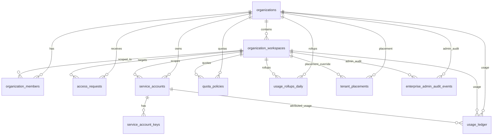

# Enterprise Runtime Model and Placement Ops Notes (F2.6)

## Purpose

This document publishes Sprint 2 runtime guidance for Track F:

- enterprise runtime entity relationships,
- tenant placement model for shared and dedicated deployment,
- migration assumptions used for staged rollout.

Use this with:

- `docs/public-api-families-d6-enterprise-governance.md`
- `docs/enterprise-scoped-credentials-migration-note.md`
- `docs/openapi/gateway.track-f-sprint1.v1.json`

## 1) Runtime Entity Relationship Map

Entity groups:

- Governance: `organizations`, `organization_workspaces`, `organization_members`, `access_requests`
- Credentials: `service_accounts`, `service_account_keys`
- Metering: `quota_policies`, `usage_ledger`, `usage_rollups_daily`
- Routing and placement: `tenant_placements`
- Admin observability: `enterprise_admin_audit_events`

## 2) Placement Model

Placement record shape (`tenant_placements`):

- key scope: `org_id` + optional `workspace_id`
- routing fields: `deployment_mode`, `cluster_id`, `region`, `routing_hint`
- lifecycle field: `status` in `active | draining | inactive`
- metadata field: `metadata_json`

Placement mode:

- `shared`: tenant runs on shared infrastructure pool
- `dedicated`: tenant runs on dedicated cluster slice (selected by `cluster_id`)

Resolver precedence:

1. workspace placement (`org_id + workspace_id`, `status=active`)
2. organization default placement (`org_id`, `workspace_id IS NULL`, `status=active`)
3. runtime defaults from environment

Runtime defaults:

- `AXME_PLACEMENT_DEFAULT_MODE` (`shared` or `dedicated`)
- `AXME_PLACEMENT_DEFAULT_REGION`
- `AXME_PLACEMENT_DEFAULT_CLUSTER_ID`

When placement is resolved for an intent flow, routing metadata is emitted into runtime details:

- `placement_source`
- `deployment_mode`
- `cluster_id`
- `region`
- `route_id`
- `org_id`
- `workspace_id`

## 3) Constraint and Integrity Notes

Constraint hardening in Sprint 2 adds:

- foreign-key links from placement, membership, service-account, quota, and usage tables to tenant roots
- uniqueness:
  - one organization-level placement default per organization (`workspace_id IS NULL`)
  - one role tuple per org/workspace/actor (`organization_members`)
  - one key hint per service account (`service_account_keys`)
- non-negative metering counters via check constraints (`usage_ledger`, `usage_rollups_daily`)

Notes:

- PostgreSQL migration includes full FK and check-constraint hardening for enterprise tables.
- SQLite migration includes placement table constraints and uniqueness/index additions used by runtime tests.

Operational implication:

- references from usage and quota records must point to existing organization/workspace scope
- placement writes must preserve org/workspace scope consistency

## 4) Migration Assumptions (Sprint 2)

Assumed migration order:

1. `0017_enterprise_core_entities`
2. `0018_tenant_placement_and_constraints`
3. `0019_enterprise_audit_events`

Assumptions for rollout safety:

- migrations run before serving traffic in app startup lifecycle
- staging rehearsal validates idempotent re-run behavior
- existing pre-constraint rows in PostgreSQL are either valid already or corrected before constraint hardening
- rollout includes backfill policy for placement coverage:
  - organization default placement row for each enterprise org
  - optional workspace override rows where dedicated routing is needed

Temporary compatibility behavior:

- if placement table is not yet available in a fresh runtime, resolver falls back to default placement values
- production target remains full placement coverage for enterprise workspaces

## 5) Ops Checklist for Dedicated Placement

1. Enable scoped credentials for enterprise admin paths.
2. Apply Sprint 2 migrations in staging and validate FK/unique/check constraints.
3. Backfill organization default placement rows.
4. Add workspace-level placement overrides only for tenants requiring dedicated routing.
5. Confirm intent routing details, usage ledger records, and admin audit events include tenant scope.
6. Promote to production after staging verification is green.

## References

- `docs/public-api-families-d6-enterprise-governance.md`
- `docs/enterprise-scoped-credentials-migration-note.md`
- `docs/openapi/gateway.track-f-sprint1.v1.json`
- `axp-spec/schemas/public_api/`
